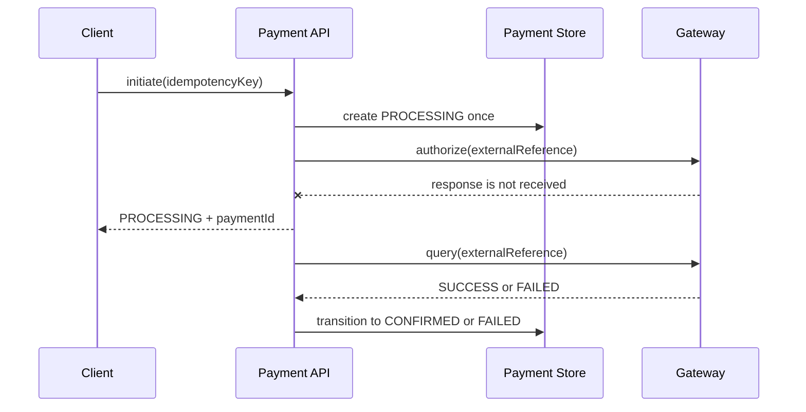

# Payment Reconciliation Lab

A small, dependency-free Kotlin project demonstrating a backend pattern for a payment request whose gateway response is uncertain.

It is a **public, recreated demonstration** based on general payment-system principles. It is not company code and does not model a specific payment provider.

## Why this exists

An API timeout is not proof that a payment failed. The gateway may have accepted the request while its response never reached our service. Retrying blindly can double-charge a customer; failing immediately can incorrectly discard a successful payment.

This lab separates the concerns:

1. **Idempotency** makes a duplicate client request return the same payment record.
2. **Initiation** records a `PROCESSING` state when the gateway outcome is unknown.
3. **Reconciliation** queries the external reference later and makes the final state transition.



## Run it

No package manager or framework is required. The Kotlin compiler (`kotlinc`) is the only prerequisite.

```bash
./run-demo.sh
```

The script compiles the source with the JDK and runs three assertions:

- repeated idempotency keys do not create multiple payments;
- an unknown gateway response stays `PROCESSING` until reconciliation;
- reconciliation is safe to call more than once.

## Design choices

| Decision | Reason | Boundary |
| --- | --- | --- |
| In-memory repository | Keeps the example runnable without infrastructure | A production implementation needs a durable database and a unique constraint on the idempotency key. |
| `PROCESSING` as an explicit state | A timeout is neither success nor failure | A scheduler, webhook, or retry worker must eventually reconcile stale records. |
| Gateway query by external reference | Resolves an uncertain response without a second authorization | Only valid when a provider exposes query semantics keyed by a stable reference. |
| Synchronized transitions | Makes this small demo deterministic | Production services should use optimistic locking or a conditional database update. |

## Project layout

```text
PaymentReconciliationDemo.kt   # runnable state machine, service, and checks
run-demo.sh                    # compiles and runs the demo
```

## Next production steps

- Persist payment and idempotency records with a unique constraint.
- Use an outbox/worker for guaranteed reconciliation delivery where appropriate.
- Authenticate and sign webhooks before they can transition payment state.
- Add provider-specific retry policy, audit trails, metrics, and alerting.
